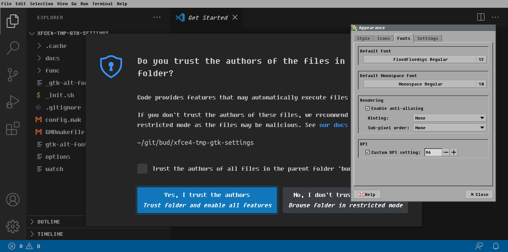
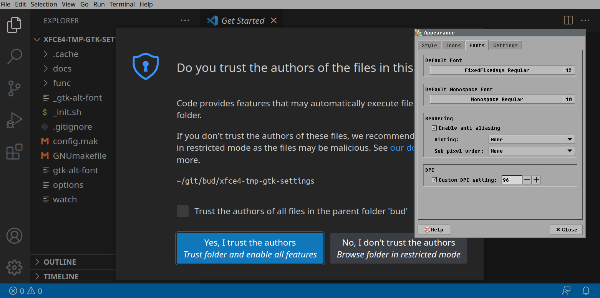

This script will temporarily set a alternative
GTK_FONT while launching a COMMAND. I like to use
a very specific font that doesn't *work* if
displayed in other sizes than 12 or if it is
decorated with **bold** or *italics* as my GTK
system font. It is usually not a problem since it
is possible to set up rules for fonts in
`fontconfig`. But **Chromium** based
applications (including f.i. electron), ignores
the fontconfig settings. This combined with the
trend among webdevs to use `system-ui` as the font
on webpages makes the web unreadable.  

It is possible to start such applications with
alternative gtk settings files. But it is a bit
hacky, and you need to keep track of
gtk2,gtk3,gtk4 settings for it to work
reliably. 

I use **Xfce** and the
settingsdaemon: **xfsettingsd**, which is a
better way to edit the GTK settings (if you for
instance, change the GTK_THEME or font it will
update on the fly in both GTK2, GTK3, GTK4). It comes
with a command line utility **xfconf-query**, but it
is quite complicated to use and remember its syntax.

So this script simply uses **xfconf-query** to get
the current gtk font, store it in a variable,
then use xfconf-query to change the font to the
content of the environment
variable **GTK_ALT_FONT**, (defaults to *"Noto Sans 12"*)
sleep 3 seconds (override with `--sleep`) in the background
while launching a COMMAND , and then revert to the original
font.

Below are two screenshots of this repo opened in VSCode:  
`code .`  
  

`gtk-alt-font -- code .`  
  

## installation

Build dependencies:  
- **GNUmake**
- **gawk**
- **bash**

Runtime dependencies:  
- **xfconf-query**
- **xfsettingsd** (*needs to be running in the background)

(*configure the installation in `config.mak`, if needed*)

```
$ git clone https://github.com/budRich/gtk-alt-font.git
$ cd gtk-alt-font
$ make
# make install
$ gtk-alt-font -h
usage: gtk-alt-font [FONT] -- COMMAND


-f, --font    FONT    | override GTK_ALT_FONT
-h, --help            | print help and exit  
-t, --sleep   SECONDS | SECONDS before reverting back the font
--verbose             | detailed output to STDERR 
-v, --version         | print version info and exit  
```  
